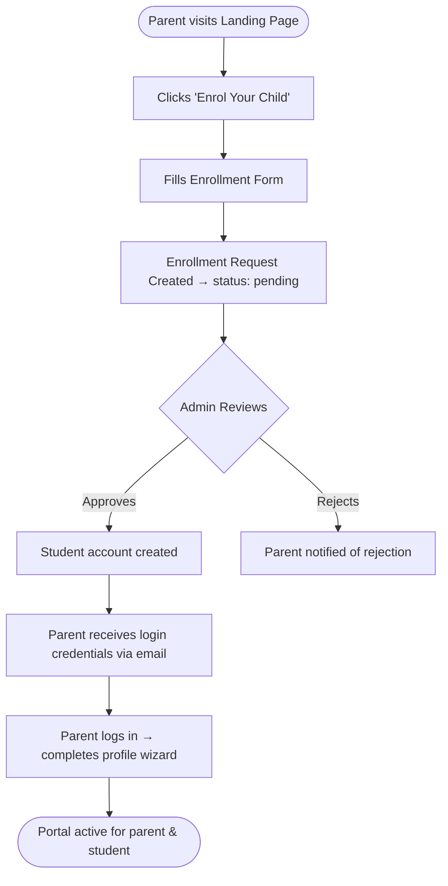
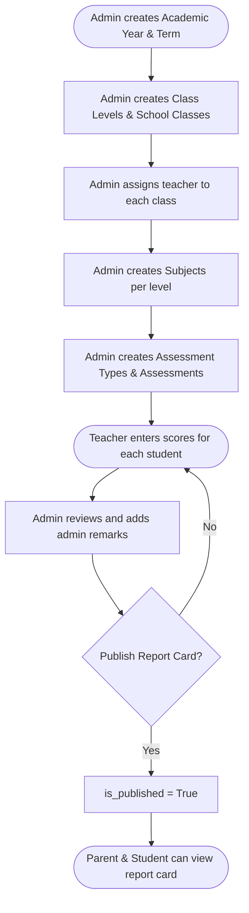
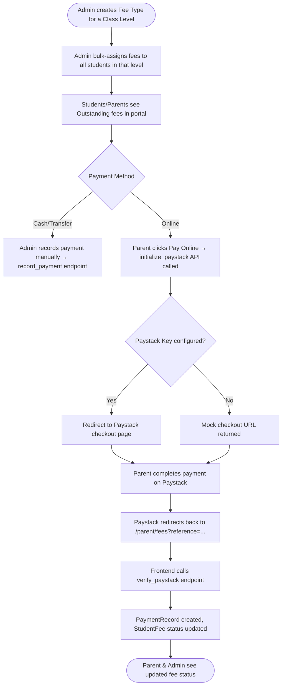
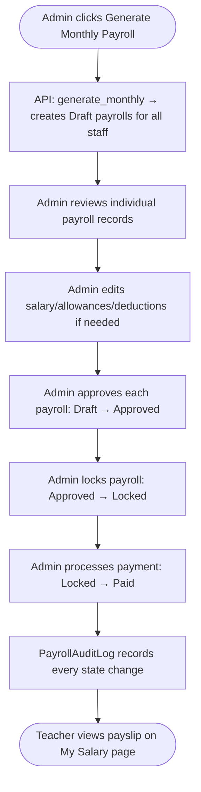

# 📚 Primary School Portal — Full Project Documentation

> **Version**: 1.0.0 · **Academic Year**: 2025/2026 · **School**: Anyi Primary School  
> **Stack**: Django 5 · React 19 · TypeScript · PostgreSQL · Redis · Docker

---

## Table of Contents
1. [Project Overview](#1-project-overview)
2. [System Architecture](#2-system-architecture)
3. [Technology Stack](#3-technology-stack)
4. [Environment Configuration](#4-environment-configuration)
5. [Database Schema / Models](#5-database-schema--models)
6. [API Reference](#6-api-reference)
7. [Frontend Architecture](#7-frontend-architecture)
8. [User Role Access Matrix](#8-user-role-access-matrix)
9. [User Workflows (with diagrams)](#9-user-workflows)
10. [Developer Setup Guide](#10-developer-setup-guide)
11. [Seeding Demo Data](#11-seeding-demo-data)
12. [Test Suite](#12-test-suite)
13. [Deployment Notes](#13-deployment-notes)

---

## 1. Project Overview

The **Primary School Portal** is a full-stack, multi-role SaaS web application designed to digitise the end-to-end operations of primary schools. It replaces paper-based record-keeping for:

| Domain | Features |
|--------|----------|
| **Enrolment** | Online parent-submitted applications → admin approval → student account |
| **Academics** | Class management, subjects, assessments, scores, report cards |
| **Attendance** | Daily student & teacher attendance, locking, reopening |
| **Finance** | School fees (with Paystack online payments), staff payroll |
| **Communication** | In-app notifications, support tickets |
| **Reports** | PDF payslips, Payroll ledgers, academic report cards |

---

## 2. System Architecture

```
                        ┌─────────────────────────────┐
                        │         INTERNET              │
                        └──────────────┬───────────────┘
                                       │ HTTPS
                              ┌────────▼────────┐
                              │   Ngrok Tunnel  │  (Public demo URL)
                              └────────┬────────┘
                                       │
                              ┌────────▼────────┐
                              │  Nginx (Port 80)│  (Reverse proxy)
                              └──┬──────────┬───┘
                                 │          │
              ┌──────────────────▼──┐  ┌───▼──────────────────┐
              │  React Frontend     │  │  Django Backend       │
              │  (Vite · Port 5173) │  │  (Gunicorn · 8000)   │
              └─────────────────────┘  └──────────┬───────────┘
                                                   │
                          ┌────────────────────────┼────────────────────┐
                          │                        │                    │
               ┌──────────▼──────────┐  ┌─────────▼──────┐  ┌────────▼────────┐
               │  PostgreSQL (5432)  │  │  Redis (6379)  │  │  Celery Workers │
               │  Primary datastore  │  │  Cache/Broker  │  │  + Celery Beat  │
               └─────────────────────┘  └────────────────┘  └─────────────────┘
```

### Container Map (docker-compose)

| Container | Image | Ports | Role |
|-----------|-------|-------|------|
| `primary_portal_db` | postgres:15 | 5432 | Primary database |
| `primary_portal_redis` | redis:7-alpine | 6379 | Cache & Celery broker |
| `primary_portal_backend` | custom Django | 8000 | REST API |
| `primary_portal_frontend` | custom React | 5173 | SPA client |
| `primary_portal_nginx` | nginx:alpine | 80 | Reverse proxy |
| `primary_portal_ngrok` | ngrok/ngrok | 4040 | Public tunnel |
| `primary_portal_celery_worker` | custom Django | — | Async tasks |
| `primary_portal_celery_beat` | custom Django | — | Scheduled tasks |
| `primary_portal_pgadmin` | dpage/pgadmin4 | 5050 | DB admin UI |

---

## 3. Technology Stack

### Backend
| Component | Technology | Version |
|-----------|-----------|---------|
| Web Framework | Django | 5.x |
| REST API | Django REST Framework (DRF) | 3.x |
| Auth | JWT via `rest_framework_simplejwt` | — |
| Token Storage | HTTP-only cookies | — |
| Async Tasks | Celery + Redis | — |
| Database | PostgreSQL | 15 |
| Payment Gateway | Paystack API (mock fallback) | — |
| Email | SMTP (console backend for dev) | — |

### Frontend
| Component | Technology | Version |
|-----------|-----------|---------|
| Framework | React + TypeScript | 19 / 5.x |
| Bundler | Vite | 7.x |
| Styling | Tailwind CSS | 3.x |
| Charts | Recharts | 3.x |
| Icons | Lucide React | 1.x |
| PDF Export | html2pdf.js | 0.14 |
| HTTP Client | Custom fetch wrapper (`api.ts`) | — |

---

## 4. Environment Configuration

Create a `.env` file at the project root (next to `docker-compose.yml`):

```env
# ── Django Security ──────────────────────────────────────
SECRET_KEY=your-very-secure-django-secret-key
DEBUG=False

# ── Database ─────────────────────────────────────────────
DB_NAME=pry_school_portal
DB_USER=portal_user
DB_PASSWORD=portal_secure_password
DB_HOST=db
DB_PORT=5432

# ── Redis ────────────────────────────────────────────────
REDIS_URL=redis://redis:6379/1
CELERY_BROKER_URL=redis://redis:6379/0
CELERY_RESULT_BACKEND=redis://redis:6379/0

# ── CORS & Hosts ─────────────────────────────────────────
ALLOWED_HOSTS=localhost,127.0.0.1,backend,0.0.0.0
CORS_ALLOWED_ORIGINS=http://localhost:5173,http://localhost:3000

# ── Ngrok (for public demo URL) ──────────────────────────
NGROK_AUTHTOKEN=your-ngrok-authtoken-here

# ── pgAdmin ──────────────────────────────────────────────
PGADMIN_DEFAULT_EMAIL=admin@school.ng
PGADMIN_DEFAULT_PASSWORD=pgadmin_password

# ── Email (dev: console / prod: SMTP) ────────────────────
EMAIL_BACKEND=django.core.mail.backends.console.EmailBackend
EMAIL_HOST=smtp.gmail.com
EMAIL_PORT=587
EMAIL_USE_TLS=True
EMAIL_HOST_USER=your@gmail.com
EMAIL_HOST_PASSWORD=your-app-password
DEFAULT_FROM_EMAIL=noreply@anyiprimaryschool.ng

# ── Paystack (leave empty for mock sandbox) ──────────────
PAYSTACK_SECRET_KEY=
PAYSTACK_PUBLIC_KEY=
```

---

## 5. Database Schema / Models

### App: `accounts`

#### `User` (Custom AbstractBaseUser)
| Field | Type | Notes |
|-------|------|-------|
| id | UUID PK | Auto-generated |
| username | CharField | Unique |
| email | EmailField | Unique, login field |
| first_name, last_name | CharField | |
| middle_name | CharField | Optional |
| role | CharField | `admin \| teacher \| parent \| student` |
| phone | CharField | Regex validated |
| date_of_birth | DateField | Optional |
| profile_photo | ImageField | Uploaded to `profiles/` |
| is_active, is_staff | Boolean | |
| first_login_completed | Boolean | Used for first-login wizard |
| last_seen | DateTimeField | Used for "online" status indicator |

#### `StudentProfile`
| Field | Type | Notes |
|-------|------|-------|
| user | OneToOne → User | student role only |
| admission_number | CharField | Unique |
| current_class | FK → SchoolClass | |
| parent | FK → User | parent role |
| gender | CharField | M/F |
| status | CharField | `active \| graduated \| transferred \| suspended` |

#### `TeacherProfile`
| Field | Type | Notes |
|-------|------|-------|
| user | OneToOne → User | teacher role only |
| staff_id | CharField | Unique |
| employment_status | CharField | `full_time \| part_time \| contract` |
| title | CharField | Mr/Mrs/Ms/Dr |
| date_of_joining | DateField | |

#### `ParentProfile`
| Field | Type | Notes |
|-------|------|-------|
| user | OneToOne → User | parent role only |
| occupation | CharField | Optional |
| relationship | CharField | Father/Mother/Guardian/Other |

#### `EnrollmentRequest`
| Field | Type | Notes |
|-------|------|-------|
| status | CharField | `pending \| approved \| rejected` |
| child_first/last_name | CharField | |
| target_class | CharField | |
| parent | FK → User | |

#### `Notification`
| Field | Type | Notes |
|-------|------|-------|
| sender | FK → User | nullable |
| recipient | FK → User | |
| title, message | CharField/TextField | |
| category | CharField | `academic \| finance \| general \| attendance` |
| is_read | Boolean | default False |
| audience | CharField | `all \| role \| selected` |

#### `SupportTicket`
| Field | Type | Notes |
|-------|------|-------|
| creator | FK → User | parent/teacher |
| subject, category | CharField | |
| priority | CharField | `low \| medium \| high \| urgent` |
| status | CharField | `open \| in_progress \| resolved \| closed` |

---

### App: `academics`

#### `AcademicYear`
| Field | Type | Notes |
|-------|------|-------|
| name | CharField | e.g. "2025/2026" |
| start_date, end_date | DateField | |
| is_current | Boolean | Only one at a time |

#### `Term`
| Field | Type | Notes |
|-------|------|-------|
| academic_year | FK → AcademicYear | |
| name | CharField | "1st Term" |
| is_current | Boolean | |

#### `ClassLevel`
| Field | Type | Notes |
|-------|------|-------|
| name | CharField | "Primary 1" – "Primary 6" |
| numeric_level | IntegerField | 1–6 |

#### `SchoolClass`
| Field | Type | Notes |
|-------|------|-------|
| name | CharField | "Primary 1" |
| level | FK → ClassLevel | |
| teacher | FK → User | class teacher |
| academic_year | FK → AcademicYear | |

#### `Subject`
| Field | Type | Notes |
|-------|------|-------|
| name | CharField | e.g. "Mathematics" |
| code | CharField | e.g. "MATH1" |
| level | FK → ClassLevel | |

#### `Assessment`
| Field | Type | Notes |
|-------|------|-------|
| school_class | FK → SchoolClass | |
| subject | FK → Subject | |
| assessment_type | FK → AssessmentType | |
| term | FK → Term | |
| max_score | DecimalField | |

#### `StudentScore`
| Field | Type | Notes |
|-------|------|-------|
| student | FK → User | |
| assessment | FK → Assessment | |
| score | DecimalField | |

#### `ReportCard`
| Field | Type | Notes |
|-------|------|-------|
| student | FK → User | |
| term | FK → Term | |
| teacher_remarks | TextField | |
| admin_remarks | TextField | |
| is_published | Boolean | Parents can only see when True |

---

### App: `finance`

#### `FeeType`
| Field | Type | Notes |
|-------|------|-------|
| name | CharField | e.g. "Tuition Fee" |
| amount | DecimalField | Naira |
| level | FK → ClassLevel | Per class level |

#### `StudentFee`
| Field | Type | Notes |
|-------|------|-------|
| student | FK → User | |
| fee_type | FK → FeeType | |
| term | FK → Term | |
| status | CharField | `paid \| partial \| outstanding` |
| amount_paid | DecimalField | Auto-updated |
| balance | Property | `fee_type.amount - amount_paid` |

#### `PaymentRecord`
| Field | Type | Notes |
|-------|------|-------|
| student_fee | FK → StudentFee | |
| amount | DecimalField | |
| payment_method | CharField | `cash \| transfer \| card \| online` |
| transaction_id | CharField | Paystack reference or manual |
| received_by | FK → User | admin recording the payment |

#### `Payroll`
| Field | Type | Notes |
|-------|------|-------|
| teacher | FK → User | teacher/admin |
| month, year | IntegerField | |
| basic_salary | DecimalField | |
| housing_allowance | DecimalField | |
| transport_allowance | DecimalField | |
| meal_allowance | DecimalField | |
| responsibility_allowance | DecimalField | |
| overtime, bonuses | DecimalField | |
| tax, pension, loans | DecimalField | Deductions |
| status | CharField | `draft → preview → approved → locked → paid` |
| gross_salary | Property | basic + allowances + bonuses |
| net_salary | Property | gross - total_deductions |

#### `PayrollAuditLog`
| Field | Type | Notes |
|-------|------|-------|
| payroll | FK → Payroll | |
| user | FK → User | who took action |
| action | CharField | e.g. "approved", "locked" |
| previous_value, updated_value | JSONField | |
| timestamp | DateTimeField | |

---

### App: `attendance`

#### `StudentAttendance`
| Field | Type | Notes |
|-------|------|-------|
| student | FK → User | |
| school_class | FK → SchoolClass | |
| term | FK → Term | |
| date | DateField | |
| status | CharField | `present \| absent \| late \| excused` |
| is_locked | Boolean | Locked after teacher submits |

#### `AttendanceSubmission`
| Field | Type | Notes |
|-------|------|-------|
| school_class | FK → SchoolClass | |
| date | DateField | |
| submitted_by | FK → User | teacher |

#### `TeacherAttendance`
| Field | Type | Notes |
|-------|------|-------|
| teacher | FK → User | |
| date | DateField | |
| check_in_time, check_out_time | TimeField | |
| status | CharField | `present \| absent \| on_leave` |

---

## 6. API Reference

**Base URL**: `http://localhost:8000/api`  
**Auth**: Bearer JWT token in `Authorization` header.

### 6.1 Authentication (`/auth/`)
| Method | Endpoint | Description | Auth |
|--------|----------|-------------|------|
| POST | `/auth/login/` | Login → returns JWT (access in body, refresh in HTTP-only cookie) | No |
| POST | `/auth/logout/` | Invalidate refresh token | Yes |
| POST | `/auth/token/refresh/` | Refresh access token from cookie | No |
| GET/PATCH | `/auth/profile/` | View/update own profile | Yes |
| POST | `/auth/change-password/` | Change own password | Yes |
| POST | `/auth/forgot-password/` | Send OTP to email | No |
| POST | `/auth/reset-password/` | Reset using OTP | No |
| GET | `/auth/dashboard/stats/` | Aggregated dashboard stats per role | Yes |
| GET/POST | `/auth/enrollment/` | Enrollment requests | Yes |
| GET | `/auth/notifications/` | User notifications | Yes |
| GET/POST | `/auth/tickets/` | Support tickets | Yes |
| POST | `/auth/parent/complete-profile/` | Parent completes first-login wizard | Yes |

### 6.2 Academics (`/academics/`)
| Method | Endpoint | Description |
|--------|----------|-------------|
| GET/POST | `/academics/years/` | Academic years |
| GET/POST | `/academics/terms/` | Terms |
| GET/POST | `/academics/levels/` | Class levels |
| GET/POST | `/academics/classes/` | School classes |
| GET/POST | `/academics/subjects/` | Subjects |
| GET/POST | `/academics/assessment-types/` | Assessment types (CA, Exam) |
| GET/POST | `/academics/assessments/` | Assessments |
| GET/POST | `/academics/scores/` | Student scores |
| GET/POST | `/academics/report-cards/` | Report cards |
| POST | `/academics/report-cards/bulk-comment-and-publish/` | Bulk publish |
| GET/POST | `/academics/events/` | School calendar events |
| GET/POST | `/academics/materials/` | Lesson materials |

### 6.3 Finance (`/finance/`)
| Method | Endpoint | Description |
|--------|----------|-------------|
| GET/POST | `/finance/fee-types/` | Fee type management |
| GET/POST | `/finance/student-fees/` | Student fee records |
| POST | `/finance/student-fees/bulk-assign/` | Bulk assign fees to class |
| POST | `/finance/student-fees/{id}/record-payment/` | Record cash/transfer payment |
| POST | `/finance/student-fees/{id}/initialize-paystack/` | Initialize online payment |
| POST | `/finance/student-fees/verify-paystack/` | Verify Paystack transaction |
| GET/POST | `/finance/payments/` | Payment history |
| GET/POST | `/finance/payroll/` | Payroll records |
| GET | `/finance/payroll/summary/` | Monthly payroll summary |
| GET | `/finance/payroll/staff-directory/` | All staff with payroll status |
| GET | `/finance/payroll/my-salary/` | Teacher's own payroll records |
| POST | `/finance/payroll/generate-monthly/` | Auto-generate monthly payroll |
| POST | `/finance/payroll/bulk-pay/` | Bulk mark as paid |
| POST | `/finance/payroll/bulk-approve/` | Bulk approve |
| GET | `/finance/payroll/reports/` | Payroll reports (monthly/register) |
| POST | `/finance/payroll/{id}/approve/` | Approve single payroll |
| POST | `/finance/payroll/{id}/lock/` | Lock single payroll |
| POST | `/finance/payroll/{id}/pay/` | Mark as paid |
| GET | `/finance/payroll/{id}/payslip/` | Download payslip |
| GET | `/finance/payroll/{id}/audit-logs/` | Audit trail |

### 6.4 Attendance (`/attendance/`)
| Method | Endpoint | Description |
|--------|----------|-------------|
| GET/POST | `/attendance/students/` | Student attendance |
| GET/POST | `/attendance/teachers/` | Teacher attendance |
| GET/POST | `/attendance/submissions/` | Attendance submission records |

---

## 7. Frontend Architecture

```
frontend/src/
├── App.tsx                    ← Route definitions (React Router v7)
├── context/
│   └── AuthContext.tsx        ← Global auth state, user object, logout
├── utils/
│   └── api.ts                 ← Fetch wrapper + token refresh + all endpoints
├── components/
│   ├── DashboardLayout.tsx    ← Sidebar + Navbar wrapper
│   ├── Sidebar.tsx            ← Role-aware navigation links
│   ├── Navbar.tsx             ← Top bar with notifications, avatar
│   ├── ProtectedRoute.tsx     ← Role-gated route wrapper
│   └── ui/
│       └── FilterDropdown.tsx ← Reusable filter component
└── pages/
    ├── LandingPage.tsx        ← Public marketing page
    ├── Login.tsx              ← Multi-role login
    ├── Enrollment.tsx         ← Parent-submitted enrollment form
    ├── Dashboard/             ← Admin & role dashboards
    ├── Students/              ← Student management (admin)
    ├── Teachers/              ← Teacher management + class tools
    ├── Parents/
    │   ├── MyChildren.tsx     ← View linked children
    │   ├── FeePayments.tsx    ← Bills + Paystack online payment
    │   ├── ParentReports.tsx  ← View child's report card
    │   └── ParentTickets.tsx  ← Support ticket submission
    ├── Academics/             ← Academic structure management
    ├── Finance/
    │   └── index.tsx          ← Full finance module (fees + payroll)
    ├── Attendance/            ← Teacher attendance submission
    ├── Reports/               ← Report card management
    ├── Scores/                ← Score entry
    └── Settings/              ← Profile & password settings
```

### Role → Routes
| Role | Key Routes |
|------|-----------|
| `admin` | `/dashboard`, `/students`, `/teachers`, `/parents`, `/classes`, `/academics`, `/finance`, `/attendance`, `/reports` |
| `teacher` | `/teacher`, `/teacher/class`, `/teacher/attendance`, `/teacher/scores`, `/teacher/salary`, `/teacher/messages` |
| `parent` | `/parent`, `/parent/children`, `/parent/fees`, `/parent/reports`, `/parent/tickets` |
| `student` | `/student`, `/student/grades`, `/student/attendance` |

---

## 8. User Role Access Matrix

| Feature | Admin | Teacher | Parent | Student |
|---------|:-----:|:-------:|:------:|:-------:|
| View all students | ✅ | ❌ | ❌ | ❌ |
| Manage fee types | ✅ | ❌ | ❌ | ❌ |
| Record cash payment | ✅ | ❌ | ❌ | ❌ |
| Initiate online payment | ✅ | ❌ | ✅ | ❌ |
| View own fees | ❌ | ❌ | ✅ | ✅ |
| Generate payroll | ✅ | ❌ | ❌ | ❌ |
| View own salary | ❌ | ✅ | ❌ | ❌ |
| Submit attendance | ✅ | ✅ | ❌ | ❌ |
| View own attendance | ❌ | ❌ | ✅ | ✅ |
| Enter scores | ✅ | ✅ | ❌ | ❌ |
| View grades/report card | ❌ | ✅ | ✅ | ✅ |
| Publish report cards | ✅ | ❌ | ❌ | ❌ |
| Upload lesson materials | ✅ | ✅ | ❌ | ❌ |
| View lesson materials | ✅ | ✅ | ❌ | ✅ |
| Create support ticket | ❌ | ✅ | ✅ | ❌ |
| Manage support tickets | ✅ | ❌ | ❌ | ❌ |

---

## 9. User Workflows

### 9.1 Student Enrollment Workflow



### 9.2 Academic Assessment & Report Card Workflow



### 9.3 Finance: Fee Billing & Paystack Payment Workflow



### 9.4 Monthly Payroll Processing Workflow



---

## 10. Developer Setup Guide

### Prerequisites
- Docker Desktop (Windows/Mac/Linux)
- Git
- A text editor (VS Code recommended)

### First-Time Setup

```bash
# 1. Clone the repository
git clone https://github.com/NobleJoe123/Pry_School_portal.git
cd Pry_School_portal

# 2. Copy and configure environment variables
cp .env.example .env
# Edit .env with your credentials

# 3. Build and start all containers
docker-compose up --build

# 4. Run database migrations (in a second terminal)
docker-compose exec backend python manage.py migrate

# 5. Create a superuser (admin account)
docker-compose exec backend python manage.py createsuperuser

# 6. Seed demo data (optional but recommended)
docker-compose exec backend python manage.py shell < populate_operations.py
```

### Access Points
| Service | URL |
|---------|-----|
| Frontend App | http://localhost:5173 |
| Backend API | http://localhost:8000/api |
| Django Admin | http://localhost:8000/admin |
| pgAdmin | http://localhost:5050 |
| Ngrok Dashboard | http://localhost:4040 |

### Daily Development Commands

```bash
docker-compose up -d           # Start in background
docker-compose down            # Stop all services
docker-compose logs -f backend # View backend logs
docker-compose restart backend # Restart single service
docker-compose exec backend python manage.py makemigrations
docker-compose exec backend python manage.py migrate
```

---

## 11. Seeding Demo Data

The `populate_operations.py` script creates a full, realistic dataset:

```bash
docker-compose exec backend python manage.py shell < populate_operations.py
```

**Creates:**
- Academic Year 2025/2026 with 3 terms
- Primary 1–6 class levels, 8 subjects per level
- 6 class teachers (Primary 1–6)
- 24 students (4 per class)
- 12 parents (2 per class)
- Student fees for current term
- Payroll records for all teachers

### Demo Login Credentials

| Role | Email | Password |
|------|-------|----------|
| Admin | `admin@anyiprimaryschool.ng` | *(set during createsuperuser)* |
| Teacher (P1) | `sarah.jenkins@school.local` | `teacher123` |
| Teacher (P4) | `john.doe@school.local` | `teacher123` |
| Parent | *(created by seeder)* | `parent123` |
| Student | *(created by seeder)* | `student123` |

---

## 12. Test Suite

```bash
# Run all tests
docker-compose exec backend python manage.py test

# Run specific app tests
docker-compose exec backend python manage.py test finance --verbosity=2
docker-compose exec backend python manage.py test academics --verbosity=2

# Frontend type-check + build
cd frontend && npm run build
```

### Test Coverage

| App | Tests | Coverage |
|-----|-------|---------|
| `accounts` | 3 tests | Auth, profile |
| `academics` | 3 tests | Report cards, bulk publish |
| `finance` | 20 tests | Fees, payments, Paystack mock, payroll |
| `attendance` | 0 tests | (Planned) |

---

## 13. Deployment Notes

### Production Checklist
- [ ] Set `DEBUG=False` in `.env`
- [ ] Set a strong `SECRET_KEY`
- [ ] Configure real SMTP email credentials
- [ ] Set `PAYSTACK_SECRET_KEY` and `PAYSTACK_PUBLIC_KEY` for live payments
- [ ] Set `ALLOWED_HOSTS` to your domain
- [ ] Add domain to `CORS_ALLOWED_ORIGINS`
- [ ] Add domain to `CSRF_TRUSTED_ORIGINS`
- [ ] Use HTTPS (SSL/TLS certificate)
- [ ] Set `SESSION_COOKIE_SECURE=True`
- [ ] Run `python manage.py collectstatic`
- [ ] Configure persistent Docker volumes for media/static files

### Nginx Configuration
The `nginx/default.conf` routes:
- `/api/*` → Backend (port 8000)
- `/admin/*` → Backend (port 8000)
- `/*` → Frontend (port 5173)

---

*Documentation generated: July 2026 · Anyi Primary School Portal v1.0*
